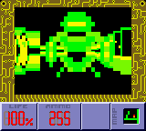
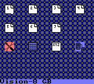
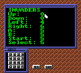
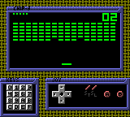
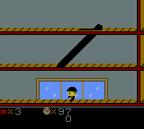
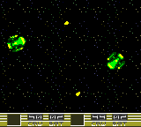
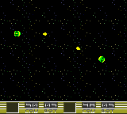

# Really old GB stuff

Here are some of my old GB projects.

## GB raycaster

This was an experiment at making a first person shooter for the gameboy using a [raycasting] algorithm.

## Vision-8 for Gameboy

This is a port of Marcel de Kogel's [Vision-8] CHIP8 emulator, plus a fancy pseudo-GUI.

## Keystone Capers for Gameboy

This is a Keystone Capers clone for GBC.

## Star Control spaceship combat for GB

This was an experiment on making a Star Control melee clone for Gameboy.

[raycasting]: https://en.wikipedia.org/wiki/Ray_casting
[Vision-8]: http://www.komkon.org/~dekogel/vision8.html

